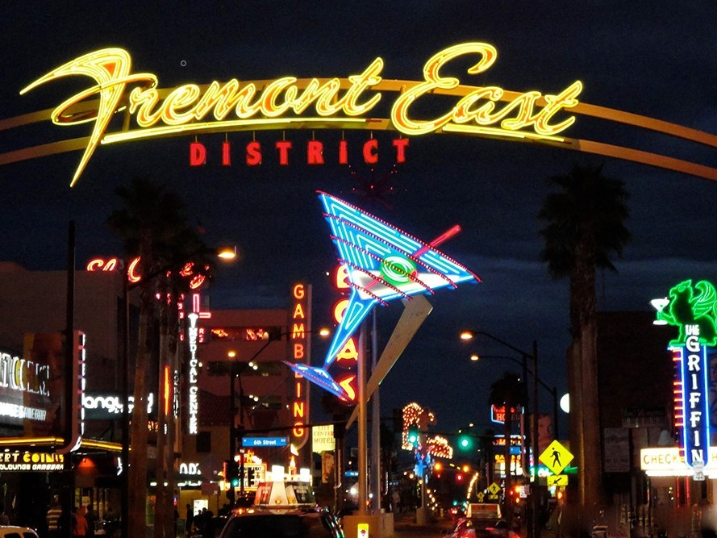

# Как Сделать Олдскульную Неоновую Вывеску.

Как сделать не дорогую и эффектную неоновую вывеску с анимацией.

## Шаг 1. Вдохновитесь старыми неоновыми вывесками

Когда мы думаем о неоновых вывесках, первое что приходит на ум это ночные улицы Лас-Вегаса 30-х годов прошлого века с бесчисленным количеством красочных неоновых рекламных щитов. Тогда неон был всюду - на каждом рекламном рекламном щите и магазинной вывеске. И что только не изображали используя неоновые лампы: звезды, напитки, танцовщицы, ковбои, индейцы, цветы, музыкальные инструменты и так далее.

Мы в Амперке решили сделать свою неоновую вывеску в духе старых времен. Было решено что на вывеске будет неоновая ковбойша рекламирующая пивной паб. Так же мы решили добавить на вывеску какую-нибудь анимацию и управлять этой анимацией с помощью Arduino.

## Шаг 2. Выбор неона

В действительности настоящие неоновые лампы для вывесок это довольно дорогое удовольствие. Неоновая лампа - газоразрядная и состоит из фигурно изогнутой стеклянной трубки наполенной газом под небольшим давлением. Цвет свечения лампы зависит от того какой газ находится в трубке. Например, неон дает красно-оранжевый цвет, гелий дает бело-оранжевый цвет а аргон - сиреневый. Однако вне завимости от газа такие лампы все равно называют неоновыми. Для того чтобы зажечь такую лампу необходим специальный трансформатор низкого тока и большого напряжения в несколько киловольт способный "выбивать" электроны из молекул газа. Величина напряжения и тока так же влияет на оттенок свечения лампы. Неоновые трансформаторы дороги а для изготовления их своими руками потребуются серьездные расчеты и электронные компоненты. Ну а выдувание фигурных стеклянных трубкок это и вовсе настоящее ремесло требущее недюжинных знаний, подготовки и инструмента. Таким образом изготовление неоновых ламп в домашних условиях практически невозможно. 

Вместо настоящих неоновых ламп можно использовать светодиодный гибкий неон. Такой неон является превосходной заменой настоящему. По своей сути гибкий светодиодный неон это обычная или адресная светодиодная лента в прозрачной силиконовой оболочке. Светодиодный неон дешевый, его свечение так же эффектно и не уступает свечению настоящей неоновой лампы, а для работы со светодиодами не нужны особые навыки.

Для этого проекта мы использовали гибкий светодиодный неон [Arlight ARL](https://arlight.ru/catalog/gibkiy-neon-arl-581/) работающий от постоянного тока напряжением 12В, с сечением 8х16мм, и кратностю реза 10мм. Типоразмер гибкого неона 8х16мм является одним из самых распространенный и его не сложно найти.

Всего мы приобрели несколько катушек неона разных длин с свечением разных цветов:

* Желтый, 5 метров;
* Теплый белый 3000К, 10 метров;
* Синий, 5 метров;
* Холодный белый 5000К, 5 метров;
* Красный, 5 метров;
* Янтарный, 5 метров;
* Зеленый, 5 метров;

## Шаг 3. Придумайте дизайн вывески

Сперва нарисуйте эскиз вашей вывески на бумаге. Определитесь с размером вывески и тем что именно и где будет на ней нарисовано. Когда эскиз готов его нужно перенести в компьютер и задеталировать. Можно использовать любые графические редакторы но мы рекомендуем создать точный чертеж вывески используя 2D или 3D CAD системы.

У нашей ковбойши желтая шляпа и зеленый шейный платок. Мы добавили персонажу две простые анимации. Первая - ковбойша подмигиваем глазом. Вторая - ковбойша поднимает свою кружку с пивом и опускает ее слегка выплескивая пивную пену. Так же мы добавили слово "SALOON" в верхний правый угол вывески. Для слова салун мы решили так же добавить световые эффекты, например мигание, или "бегущий огонек".

Вот некоторые ключевые моменты при дизайне вывески:
* Чертеж вывески должен состоять из линий-конктуров. Линии контуры на чертеже соответствуют местам где будут впоследствии установлены отрезки гибкого светодиодного неона на реальной вывеске.
* Рисунок, персонажи, предметы на вывеске должены быть как можно проще. Но в то же время рисунок должен быть информативным.
* Для линий-контуров используйте плавные кривые линии и сплайны. Старайтесь избегать острых уголов и маленьких радиусов кривизны, ведь по ним потом не получится согнуть ленту. 
* Ширина каждой линии-контура на чертеже соответствует ширине того гибкого неона который вы испольуете. В нашем случае - 8мм.
* Длина каждой линии-контура должна быть кратна минимальной длине реза гибкого неона. В нашем случае кратность реза неоновой ленты - 10мм а длины всех контуров кратны 10мм. Используя CAD систему узнать длину сплайна или кривой не сложно.
* При использовани гибкого неона не допускайте перекрещивания. Если один отрезок ленты светодиодного неона наложится на другой то свечение будет видно только от верхнего отрезка. Если же вам все таки необходимо создать пересечение двух линий-контуров то попробуйте разрезать одну из линий в месте пересечения. Для примера взгляните на "подмигивающий" глаз нашей ковбойши. 
* Раскрасьте линии-контуры в те цвета которые соответствуют реальным цветам вашего гибкого неона.
* Помимо линий-контуров отрезков светодиодных лент не забудьте нарисовать и контур для основы всей вывески.

Для примера прикладываем [CAD чертеж нашей вывески в формате DWG](./files/drawing-dwg.dwg).

## Шаг 4. Перенесите чертеж на основу вывески

Выберите материал из которого будет изготовлена основа для вашей вывески. За основу мы решили взять лист фанеры размерами 1500х1500мм и толщиной 10мм.

Перенесите готовый чертеж на вашу основу для вывески. Для переноса нашего рисунка мы распечатали его в масштабе 1:1 на нескольких листах А4 и склеили листы между собой.

Затем мы постепенно отрезали контуры с бумаги и карандашом повторяли их на фанере. На основу нужно перенести как контуры светодиодных лент так и контур всей вывески.

## Шаг 5. Вырежьте контур вывески

Когда все контуры перенесены на основу, можно выпилить контур вывески. Мы выпилили контур электролобзиком используя пилку по дереву.

## Шаг 6. Примерьте отрезки неоновых лент

Отрежьте от гибкого неона отрезки нужного цвета и длины согласно чертежу.

Теперь можно приступить к примерке неоновых отрезков. Прикрепить неон к основе можно разными способами, например клеем, но мы решили зафиксировать их гвоздями. Мы использовали бронзовые гвозди без головки, толщиной 1,2 мм и длиной 20 мм.

Мы разместили гвозди по обе стороны неоновых лент таким образом что гвозди сдавливают неоновую ленту с ее боков. Не следует забивать гвозди до конца, необходимо лишь обеспечить надежное сдавилвание ленты. Так же с помощью гвоздей очень удобно создавать нужные изгибы гибкого неона. Лучше всего вбивать гвозди в образующие точки кривых линий-контуров.

Мы запланировали довольную крупную вывеску так что нам пришлось вбить около тысячи гвоздей. Довольно рутинная задача, так что обязательно придумайте как развлечь себя в процессе.

Примерьте все отрезки неона согласно чертежу. Убедитесь что все размеры сошлись с чертежем и вывеска выглядит так как вам нужно. Сейчас последний шанс что то подправить, например укоротить или удлинить тот или иной отрезок, изменить изгиб или вбить больше фиксирующих гвоздей.

После примерки снимите все отрезки неона с основы.

## Шаг 7. Подготовьте и покрасьте основу вывески

Следующий шаг это покраска основы для вывески.

Перед покраской нужно сделать в основе отверстия для проводов питающих неоновые отрезки. Питающие провода будут уходить с лицевой стороны вывески на заднюю сторону. Отверстия должны находиться на краях неоновых отрезков. Для каждого неонового отрезка светодиодной ленты выберите край куда будут уходить провода. Мы просверлили отверстия диаметром 3м.  

Если на вашей основе есть сколы или неровности самое время исправить их. Мы обработали края основы рашпилем и наждачкой и замазкой по дереву.

При желании наложите загрунтуйте основу перед покраской. С грунтовкой краска продержится дольше. Мы использовали обычный грунт по дереву.

Покрасьте основу в любой нужный вам цвет. Мы решили сделать бекграунд вывески черным и задули основу черной акриловой краскной в баллончиках. 

## Шаг 8. Припаяйте провода к неоновым отрезкам

Пока краска на основе вывески сохнет можно заняться пайкой проводов. 

Провода нужно припаять к одному торцу каждого отрезка гибкого неона. Всего нужно два провода один на плюс другой на минус.

Провода можно использовать любые. Но лучше не выбирать слишком толстые и короткие провода.

После пайки. концы отрезков неоновых лент необходимо загерметизировать. Это строго необходимо если вы планируете установить вывеску на улице. Герметичные края защитят светодиодные ленты от дождя, пыли и грязи. Загерметизировать концы отрезков можно разными способами. 

Можно использовать стандартные силиконовые колпачки-заглушки. Такие заглушки скорее всего можно найти там же где и катушки с гибким неоном.

Однако в нашем случае такие силиконовые колпачки оказались слишком толстыми. Края гибкого неона в колпачках тяжело зажимались между гвоздями. Поэтому мы решили загерметизировать края гибкого неона прозрачными жидкими гвоздями и клеевым пистолетом.

## Шаг 9. Установите неон

Когда основа вывески покрашена а провода припаяны к отрезкам неоновых лент, ленты можно установить на основу. 

Просуньте припаяный провода в подготовленные отверстия в основе вывески.

Установите все неоновые отрезки и надежно зажмите их между гвоздей. Вытаскивать неон больше не потребуется.

## Шаг 10. Выберите электронные компоненты

Какая нам понадобится для управления неоновой вывеской?

* Чтобы реализовать эффекты анимации, необходимо включать и выключать отдельные отрезки неоновых светодиодный лент независимо друг от друга. Для управления такой нагрузкой как светодиодная лента идеально подходит силовой ключ на MOSFET транзисторе. А для одновременной работы с несколькими подобными нагрузками можно использовать сборку из нескольких силовых ключей. Мы использовали две наших сборки из восьми силовых ключей в формате zelo-модуля. Всего в нашем распоряжении 16 полевых транзисторов.

[Сборка силовых ключей P-FET (Zelo-модуль)](https://amperka.ru/product/zelo-p-fet)

Каждая такая сборка способна коммутировать восемь отдельных силовых каналов постоянного тока напряженим до 30В и током до 3А. Этого более чем достаточно для коммутации не слишком длинных светодиодных лент. Управляется сборка силовых ключей через интерфейс SPI и ее легко можно подключить к Arduino.

* Вывеска будет питаться от обычной розетки и для питания светодиодных лент понадобится AC-DC источник питания. Наши неоновые ленты работают от постоянного тока напряжением 12В так что нужен блок питания на 12В. Выбирать такой блок питания следует исходя из максимального потребляемого неоновыми лентами тока. Суммарная длина всех отрезков неоновых лент на нашей вывеске получилась около 22 метров. Мы запитали все отрезки неона от лабораторного блока питания и измерили весь потребляемый ток амперметром. Получилось около 7 - 8А. Таким образом нужен блок с запасом по току, например на 12,5А.

[MEAN WELL Блок питания, 12В, 12.5А, 150Вт](https://www.chipdip.ru/product/lrs-150-12)

* Нужен микроконтроллер который будет управлять эффектами анимации. Мы используем самую популярную в DIY мире плату Arduino Uno.  

[Arduino Uno Rev3](https://amperka.ru/product/arduino-uno)

Arduino Uno с понижающим преобразователем напряжения с 12В до 5В на борту идеально вписывается в наш проект.

## Шаг 11. Схема подключения

После выбора электронных компонентов подумайте о схеме их подключения. Вот как мы решили все подключить:

### Питание

Гибкий неон работает от 12В DC. Источник питания преобразует 220В AC из розетки в 12В DC. Полученные 12В поступают на:
* VIN пины внешнего питания платы Arduino Uno;
* VIN колодки внешнего питания на двух сборках силовых ключей;
* Все неоновые части вывески которые не учавствуют в анимации, то есть горят постоянно.

### Логика

Сборки силовых ключей управляются посредством упрощенного SPI интерфейса. Одна сборка подключается к контроллеру четырьмя проводами:
* CS - chip select; D3 пин Arduino Uno;
* MOSI - master output slave input; D11 пин Arduino Uno;
* SCL - clocking line; D13 пин Arduino Uno;
* GND - ground; Земля, присоединена к земле на плате Arduino Uno;

Имея две сборки силовых ключей нет необходимости подключать каждую из них к микроконтроллеру отдельно. Вместо этого две сборки можно подключить последовательно (в цепочку). Таким образом вместо двух сборок на восемь каналов получится одно устройство на шестнадцать каналов. 

### Каналы

Всего в нашем распоряжении 16 каналов и вот как мы их распределили:
* CH0 - управление буквой "S" слова "SALOON";
* CH1 - управление буквой "A" слова "SALOON";
* CH2 - управление буквой "L" слова "SALOON";
* CH3 - управление первой буквой "O" слова "SALOON";
* CH4 - управление второй буквой "O" слова "SALOON";
* CH5 - управление буквой "N" слова "SALOON";
* CH6 - управление "открытым" глазом ковбойши;
* CH7 - управление "подмигивающим" глазом ковбойши;
* CH8, CH9 - Управление опущенной вниз кружкой пива; Эта часть вывески потребляет много тока. Мы обьеденили два канала в один для уменьшения нагрузки на транзистор;
* CH10 - не используется;
* CH11, CH12 - Управление поднятой вверх кружкой пива; Эта часть вывески потребляет много тока. Мы обьеденили два канала в один для уменьшения нагрузки на транзистор.
* CH13, CH14, CH15 - не используются;

## Шаг 12. Корпус электроники

Со схемой разобрались. Теперь можем подумать о корпусе для всех электронных компонентов. 

Мы решили поместить всю электронику в пластиковый ABS водонепроницаемый корпус а для проводов использовать герметичные кабельные вводы. 

Надежный и герметичный корпус крайне необходим если вы планируете разместить вашу вывеску на улице.

В корпусе мы разместили текстолитовую подложку а уже на ней закрепили все электронные компоненты.

## Шаг 13. Кабель менеджмент

Мы закрепили коробку с электронной начинкой на задней стороне вывески. 

Пришло время протянуть все провода от всех неоновых лент в коробку с электроникой. Для фиксации проводов на основе вывески мы использовали кабельные стяжки.

## Шаг 14. XOD

Для создания программы мы используем язык визуального программирования XOD. XOD не требует обширных навыков в программировании и является идеальный выбором для новичков в мире Ардуино. XOD подходит для быстрого прототипрования различных устройств или быстрого создания не сложных программ. 

Всю XOD программу для управления нашей вывеской мы разместили в отдельной XOD бибилиотеке [`gabbapeople/neon-saloon`](https://xod.io/libs/gabbapeople/neon-saloon/).
В этом проекте мы использовали XOD библиотеку для управления сборкой силовых ключей [`amperka/octofet`](https://xod.io/libs/amperka/octofet/). Эта 

## Шаг 15. Программировние

Вот какой итоговый патч программы у нас получился.

Заметьте, не обязательно использовать конкретно этот патч в проекте вашей вывески. Этот патч скорее служит в качестве примера того каким обрзом анимацию можно запрограммировать. Рассмотрим программу и ее принцип работы подробнее. 

В библиотеке `gabbapeople/neon-saloon` есть три главные ноды - `saloon`, `eye` и `beer-mug`. Каждая из этих нод ответственна за управление эффектами определенной части вывески. 
Нода `saloon` управляет надписью SALOON, нода `eye` управляет подмигиванием глаза ковбойши а нода `beer-mug` управляет пивной кружкой. Эти три ноды составные и по своей сути состоят из счетчиков и генераторов прямоугольных импульсов. Помимо этого на патче находится нода `octofet-16` из библиотеки `amperka/octofet`. Эта нода отвечает за работу двух сборок силовых ключей обьединенных в цепочку. 

Подробнее а пинах каждой ноды.

### Нода `saloon`

На выходе нода имеет шесть пинов типа `boolean`. Каждый из этих шести пинов соотвествует одной из шести букв в слове SALOON. Идея проста, если выходной пин имеет значение `true` то буква горит, если `false ` то горит. На входе нода `saloon` имеет множество пинов. Эти пины описывают фунцкии ноды. Всего у ноды четыре функции:

* Зажечь все буквы в слове. 
- Пин `ALL_U` (all up). Входной `pulse` сигнал на этом пине включит свет на всех шести буквах слова SALOON.

* Погасить все буквы в слове.
- Пин `ALL_D` (all down). Входной `pulse` сигнал на этом пине выключит свет на всех шести буквах слова SALOON.

* Мигнуть всеми буквами в слове.
- Пин `BLNK` (blink) - Входной `pulse` сигнал на этом пине запустит мигающаую последовательность всех букв в слове SALOON.
- Пин `BN` (blink number) - Целочисленное значение. Количество раз сколько нужно мигнуть.
- Пин `B_Ton` - Время в секундах. Задает время втечение которого буквы остаются включеными во время мигающей последовательности.
- Пин `B_Toff` - Время в секундах. Задает время втечение которого буквы остаются выключеными во время мигающей последовательности.
- Выходной пин `B_D` (blink done) - Сгенерированный `pulse` сигнал на этом пине информирует о том что мигающая последовательность завершила работу.

* Зажечь все буквы в слове последовательно.
- Пин `ACC` (accumulate) - Входной `pulse` сигнал на этом пине запустит последовательное зажжение всех букв в слове начиная с первой.
- Пин `A_Ton` - Время в секундах. Интервал между зажжением букв.
- Выходной пин `A_D` (accumulate done) - Сгенерированный `pulse` сигнал на этом пине информирует о том что последовательное зажжение букв завершилось.

### Нода `eye`

На выходе нода имеет два пина типа `boolean`. Пин `EYEO` (eye open) управляет открытым глазом неоновой ковбойши а пин `EYEC` (eye closed) закрытым. Всего у ноды три функции:

* Открыть глаз.
- Пин `O` (open) - Входной `pulse` сигнал на этом пине зажжет те части неоновых лент что подсвечивают открытый глаз ковбойши и погасит те части что подсвечивают закрытый.

* Закрыть глаз.
- Пин `C` (close) - Входной `pulse` сигнал на этом пине зажжет те части неоновых лент что подсвечивают закрытый глаз ковбойши и погасит те части что подсвечиввают открытый.

* Мигнуть глазом.
- Пин `BLNK` (blink) - Входной `pulse` сигнал на этом пине запустит мигающаую последовательность для глаза.
- Пин `N` (number) - Целочисленное значение. Количество раз сколько нужно мигнуть.
- Пин `Ton` - Время в секундах. Задает время втечение которого глаз открыт во время мигающей последовательности.
- Пин `Toff` - Время в секундах. Задает время втечение которого глаз закрыт во время мигающей последовательности.
- Выходной пин `B_D` (blink done) - Сгенерированный `pulse` сигнал на этом пине информирует о том что мигающая последовательность завершила работу.

### Нода `beer-mug`

На выходе нода имеет два пина типа `boolean`. Пин `BUP` (beer up) управляет поднятой кружкой пива а пин `BDOWN` (beer down) опущенной. Всего у ноды три функции:

* Поднять кружку
- Пин `U` (up) - Входной `pulse` сигнал на этом пине зажжет те части неоновых лент что подсвечивают поднятую кружку пива и погасит те части что подсвечивают опущенную кружку.

* Опустить кружку
- Пин `D` (down) - Входной `pulse` сигнал на этом пине зажжет те части неоновых лент что подсвечивают опущенную кружку пива и погасит те части что подсвечивают поднятую кружку.

* Потрясти кружкой
- Пин `BLNK` (blink) - Входной `pulse` сигнал на этом пине запустит последовательное мигание поднятой и опущенной кружкойю
- Пин `N` (number) - Целочисленное значение. Количество раз сколько потрясти кружку.
- Пин `Ton` - Время в секундах. Задает время втечение которого кружка находится наверху.
- Пин `Toff` - Время в секундах. Задает время втечение которого кружка находится внизу.
- Выходной пин `B_D` (blink done) - Сгенерированный `pulse` сигнал на этом пине информирует о том что ковбойша потрясла кружкой нужное число раз.

### Алгоритм работы

Используя описанные выше функции мы составили следующую последовательность работы программы:

- Начало работы программы. Задержка в 3 секунды.
- Глаз ковбойши открыт, кружка опущена, надпись SALOON не горит.
- Запуск цикла.

Цикл:
- Буквы надписи SALOON начинают загораться последовательно.
- Задержка 1 секунда.
- Ковбойша подмигивает 1 раз. Одновременно с эти надпись SALOON мигает 1 раз.
- Задержка 1 секунда.
- Ковбойша трясет кружкой 1 раз. Одновременно с эти надпись SALOON мигает 1 раз.